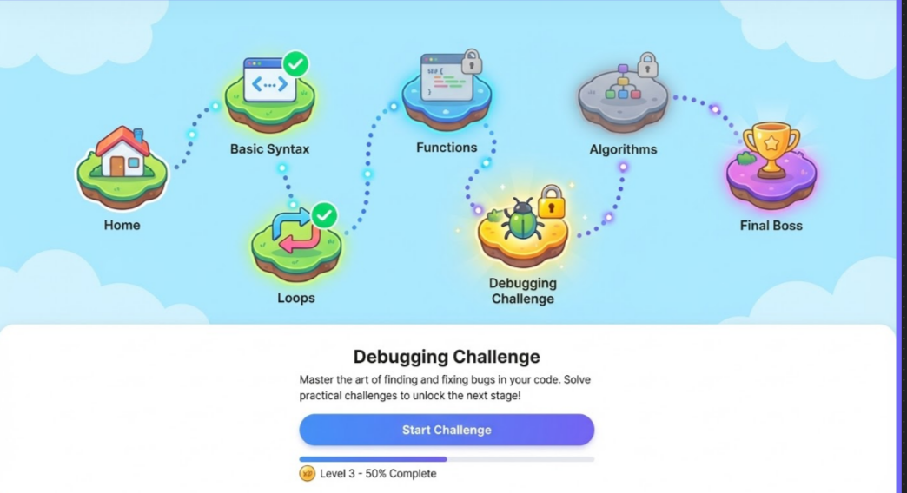
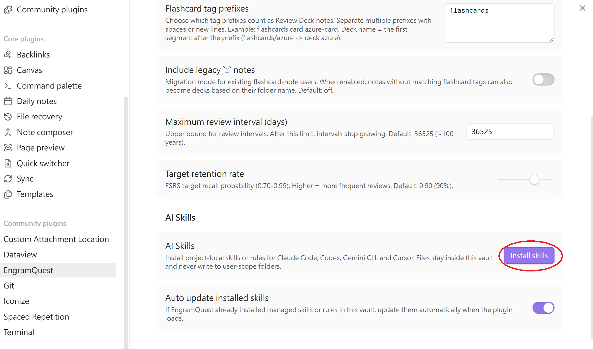
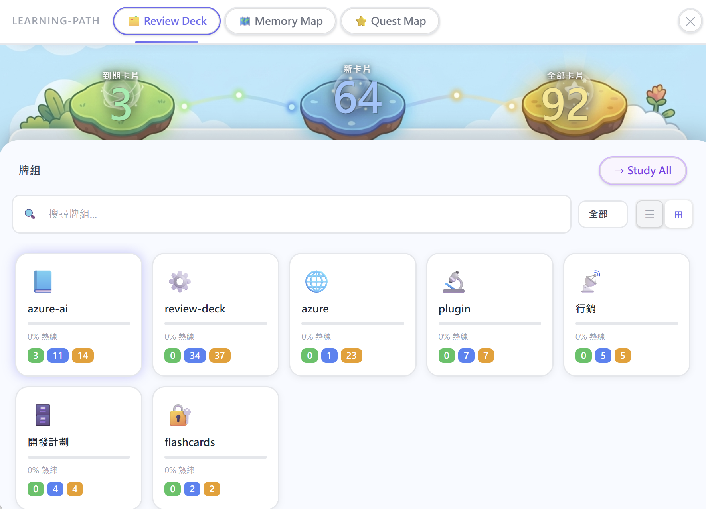

# 🗺️ EngramQuest

[English](#english) | [繁體中文](#chinese)

---

<a name="english"></a>
## English

**The spaced-repetition system built for Obsidian notes. Write cards yourself, or let AI help — your notes stay clean, your memory stays yours.**



EngramQuest turns your Obsidian vault into a long-term memory system. Write flashcards directly in your notes, or use AI tools (Claude Code, Gemini CLI, Cursor) to generate cards, quest challenges, and visual memory maps — all without touching your original markdown.

### ✍️ Write Cards Yourself (No AI Required)

Add a tag and pick a format. Three formats are supported and freely mixable in one note:

```
#flashcards/math

Pythagorean theorem :: a² + b² = c²

Q: What is a derivative?
A: The instantaneous rate of change of a function at a point.
   Formally: lim(h→0) [f(x+h) − f(x)] / h

{{c1::Calculus}} is built on limits, derivatives, and integrals
Capitals: France {{c1::Paris}}, Japan {{c2::Tokyo}}
```

| Format | Best for | Syntax |
|---|---|---|
| `::` Q&A | Short answers, one line | `question :: answer` |
| `Q:/A:` Q&A | Multi-line or bullet answers | `Q: question` → `A:` (answer can start on next line; single blank line within answer is ok; **two blank lines** end the card) |
| `{{c1::}}` Cloze | Fill-in-the-blank, Anki-compatible | `{{c1::answer}}` or `{{c1::answer::hint}}` |

**Tag format:** `#flashcards/topic` — the name after the slash is the Deck name. Change the prefix (`flashcards`) in Settings.

Open Hub → Review Deck to see all your cards automatically.

### ⚡ Quick Start (AI Path)

1. **Install Plugin:** Install **EngramQuest** via Obsidian Community Plugins or [GitHub Releases](https://github.com/bahfahh/engram-quest/releases).
2. **Install Skills:** Go to `Settings → EngramQuest → AI Skills` and click **Install** for your tool (Claude Code, Gemini CLI, Cursor, or Codex).
   
3. **Ask AI:** *"Turn `Note.md` into a quest-map medium"* or *"Build a review deck from notes tagged with math."*
4. **Open Hub:** Click the EngramQuest ribbon icon, switch to the relevant tab, and start learning.

### ✨ Key Features

#### 🃏 Review Deck
Scientific long-term memory powered by the **FSRS Algorithm**.

- **Three card formats:** `::` one-liner, `Q:/A:` multi-line, and `{{c1::}}` Cloze (Anki-compatible)
- **Auto-detection:** Scans any note tagged with `#flashcards/topic` — write cards wherever it fits your workflow
- **Notes stay clean:** Cards and scheduling data live in `engram-review/` — your original markdown is never modified
- **Source note link:** Every card connects back to its origin note — tap to read context, then resume right where you left off
- **Triple-level Hints:** Stuck? AI provides L1 (active recall prompt), L2 (context anchored to your own vault notes), or L3 (narrowing hint). L2 is what makes AI useful here — it links new knowledge to things you already know in your vault.
- **FSRS scheduling:** Intervals adapt to your actual recall performance — no review pile guilt

#### 🗺️ Quest Map
Turn long notes into structured, game-like learning stages — embedded directly in your vault as a `.md` file.
- **AI-generated challenges:** Multiple-choice, cloze fill-in, ordering, matching, and **image occlusion** (mask regions of your vault images as questions)
- **Difficulty Scaling:** Request **Easy**, **Medium**, or **Hard** modes from your AI
- **Visual Progress:** Track mastery per chapter and unlock the final Boss challenge

#### 🧠 Memory Map
Visualize abstract concepts using Obsidian Canvas.
- **Association Building:** AI maps note relationships into visual knowledge chunks
- **Deep Intuition:** Contrast, analogy, and contextual anchoring for difficult topics

### ☕ Support My Work
If you find EngramQuest helpful, consider supporting its development!

[](https://ko-fi.com/wen_aidev)

### 🔬 Why It Works
EngramQuest is built on three pillars of cognitive science:
1. **Spaced Repetition:** Review at the moment of near-forgetting. FSRS calculates intervals automatically.
2. **Retrieval Practice:** Active recall before seeing the answer is far more effective than re-reading.
3. **Elaborative Encoding:** Visual structures and concept maps build deeper cognitive links than text alone.

### ❓ FAQ

**Q: Do I have to use AI?**  
**A:** No — and many users don't. Write cards yourself with `::`, `Q:/A:`, or `{{c1::}}` syntax, add a `#flashcards/topic` tag, and the plugin picks them up automatically.

AI adds value in two specific ways: generating cards and quest challenges from notes you haven't formatted yet, and building L2 contextual hints that anchor each card to your personal vault knowledge — making recall stronger than isolated memorization.

**Q: Where is my progress stored?**  
**A:** Review progress is stored in `engram-review/sr/` inside your vault as JSON files. Your original notes are never modified.

**Q: Does EngramQuest support Anki?**  
**A:** Yes. Pair it with the **Obsidian_to_Anki** community plugin. AI-generated cards use the `question :: answer` format and include a `TARGET DECK` field in frontmatter — both are natively compatible with Obsidian_to_Anki. Install Obsidian_to_Anki + AnkiConnect, enable RemNote-style (`::`) syntax in its settings, and sync. Your cards will appear in Anki automatically.

**Q: How can I make AI always follow a specific pattern when building a Review Deck?**  
**A:** Mark key answers in your notes using any syntax — Obsidian highlight `==text==`, bold `**text**`, or any custom marker. Then add a rule to your AI config file (`CLAUDE.md`, `GEMINI.md`, or `AGENTS.md`):
> `IMPORTANT: When building a Review Deck, every highlighted ==text== must be turned into a review card.`

---

<a name="chinese"></a>
## 繁體中文

**Obsidian AI 原生學習系統 — 手動寫卡與 AI 生成，兩種用法都是一等公民。**


EngramQuest 將你的筆記變成互動學習路徑。你可以自己在任何筆記裡寫卡片，也可以讓 AI 工具（Claude Code、Gemini CLI、Cursor）幫你生成。兩條路用的是同一個間隔重複引擎、同一套 Quest Map 和 Memory Map。

### ✍️ 自己手動寫卡（不需要 AI）

加一個 tag，選一種格式，三種格式可以在同一篇筆記裡自由混用：

```
#flashcards/學習科學

畢氏定理 :: a² + b² = c²

Q: 間隔重複的原理是什麼？
A: 在快忘記時複習，可以用最少時間達到最高記憶保留率。
   每次成功回想後，下次複習的間隔會自動拉長。

{{c1::間隔重複}} 是最有效的長期記憶方法之一
法國首都 {{c1::巴黎}}，日本首都 {{c2::東京}}
```

| 格式 | 適合 | 寫法 |
|---|---|---|
| `::` 問答 | 簡短答案，一行 | `問題 :: 答案` |
| `Q:/A:` 問答 | 答案有多行或列點 | `Q: 問題` → `A:` 後可空（答案從下行開始）；答案裡一個空行沒問題；**兩個連續空行**代表卡片結束 |
| `{{c1::}}` 填空 | 填空記憶，Anki 相容語法 | `{{c1::答案}}` 或 `{{c1::答案::提示}}` |

**Tag 格式：** `#flashcards/主題` — 斜線後的名稱就是 Deck 的名字。前綴（`flashcards`）可在設定中修改。

開 Hub → Review Deck，你寫的卡片會自動出現。

### ⚡ 快速上手（AI 路徑）

1. **安裝外掛：** 在 Obsidian 安裝 **EngramQuest**（社群外掛商店或 [GitHub Releases](https://github.com/bahfahh/engram-quest/releases)）。
2. **安裝 Skills：** 前往 `設定 → EngramQuest → AI Skills`，選你用的工具（Claude Code、Gemini CLI、Cursor 或 Codex）點 **Install**。
   
3. **告訴 AI：** *「把 `筆記名稱.md` 做成 quest-map medium」* 或 *「把 tag:math 的筆記做成 review deck」*。
4. **開 Hub：** 點側邊欄的 EngramQuest 圖示，切到對應分頁，開始學習。

### ✨ 核心特色

#### 🃏 Review Deck（長期記憶）
基於 **FSRS 演算法** 的科學間隔重複。

- **三種卡片格式：** `::` 一行問答、`Q:/A:` 多行問答、`{{c1::}}` Cloze 填空（Anki 相容）
- **自動偵測：** 任何帶有 `#flashcards/主題` tag 的筆記都會被掃描，卡片寫在哪裡都能偵測到
- **筆記永遠不被修改：** 卡片與排程資料存在 `engram-review/`，原始 markdown 完全不動
- **來源筆記連結：** 每張卡片都連結回原始筆記 — 點一下跳去看脈絡，看完直接回到剛才的卡片
- **三段式提示：** 想不起來時，AI 提供 L1（主動回想提示）、L2（錨定你自己 vault 筆記的情境）或 L3（縮小範圍提示）。L2 是 AI 真正有價值的地方 — 把新知識連結到你已經知道的東西
- **FSRS 排程：** 間隔根據你的實際回想表現自動調整，不會堆積複習壓力

#### 🗺️ Quest Map（學習地圖）
將枯燥的長篇筆記變成結構化的遊戲關卡，直接嵌入 vault 成為一個 `.md` 檔案。
- **AI 生成挑戰：** 選擇題、Cloze 填空、排序題、連連看，以及**圖片遮蔽題**（把你 vault 裡的圖片局部遮住當題目）
- **難度分級：** 可要求 AI 生成 **Easy**（初探）、**Medium**（鞏固）或 **Hard**（精通）模式
- **視覺進度：** 直觀看到每個章節的掌握程度，解鎖最終 Boss 挑戰

#### 🧠 Memory Map（視覺記憶）
利用 Obsidian Canvas 將抽象概念具象化。
- **關聯建構：** AI 自動分析筆記間的關聯，建立視覺化知識區塊
- **深度理解：** 透過對比、類比與情境錨定攻克最難記的知識點

### ☕ 支持我的工作
如果你覺得 EngramQuest 對你有幫助，歡迎贊助支持開發！

[](https://ko-fi.com/wen_aidev)

### 🔬 為什麼有效？
EngramQuest 結合了三大學習科學原理：
1. **間隔重複 (Spaced Repetition)：** FSRS 演算法在快忘記時安排複習，最大化記憶效率。
2. **提取練習 (Retrieval Practice)：** 先回想再看答案，效果遠勝重複閱讀。
3. **精細編碼 (Elaborative Encoding)：** 將文字轉化為視覺結構，建立更深層的認知連結。

### ❓ 常見問題

**Q: 我一定要用 AI 嗎？**  
**A:** 不需要 — 很多使用者根本不用 AI。用 `::` 問答、`Q:/A:` 多行問答或 `{{c1::}}` Cloze 填空在任何筆記裡寫卡片，加上 `#flashcards/主題` tag，插件就會自動偵測。

AI 在兩個地方真正有價值：從你還沒整理的筆記快速生成卡片和 Quest 關卡，以及建立 L2 情境提示 — 把每張卡片錨定到你個人 vault 裡已有的知識，讓回想比孤立記憶更有效。

**Q: 我的學習進度存哪裡？**  
**A:** 複習進度存放在 vault 內的 `engram-review/sr/` 資料夾，以 JSON 格式儲存。你的原始筆記永遠不會被修改。

**Q: EngramQuest 支援 Anki 嗎？**  
**A:** 支援。可搭配 **Obsidian_to_Anki** 社群插件使用。AI 生成的卡片採用 `question :: answer` 格式，frontmatter 也包含 `TARGET DECK` 欄位，兩者都與 Obsidian_to_Anki 原生相容。只需安裝 Obsidian_to_Anki + AnkiConnect，在設定中開啟 RemNote style（`::` 語法），同步後卡片就會自動出現在 Anki 中。

**Q: 如何讓 AI 每次建立 Review Deck 時都依照我想要的固定模式？**  
**A:** 用你習慣的語法在筆記中標記重要答案，例如高亮 `==文字==`、粗體 `**文字**` 或自訂記號，再到 AI 設定檔（`CLAUDE.md`、`GEMINI.md` 或 `AGENTS.md`）加入規則：
> `IMPORTANT: When building a Review Deck, every highlighted ==text== must be turned into a review card.`

---
*為終身學習者打造。Made with ❤️.*
