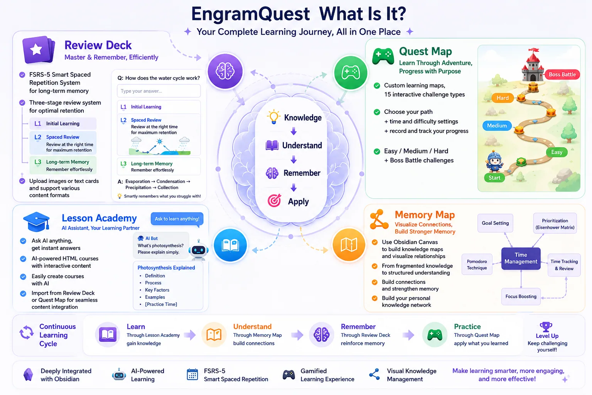
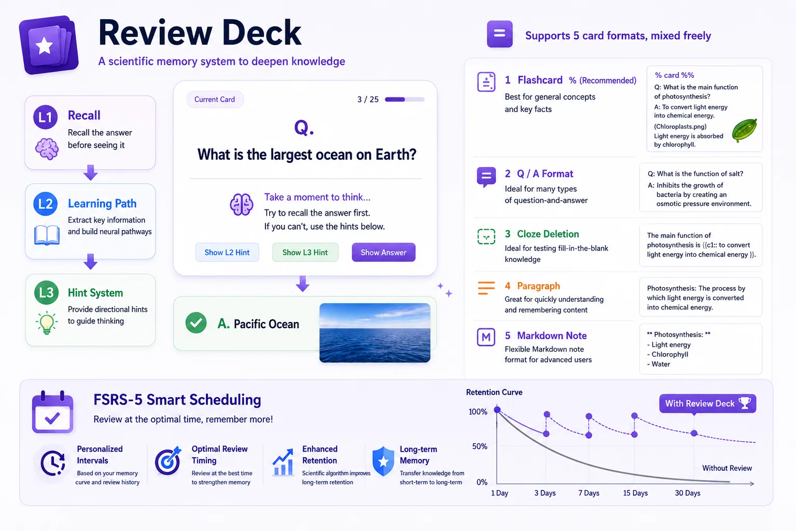
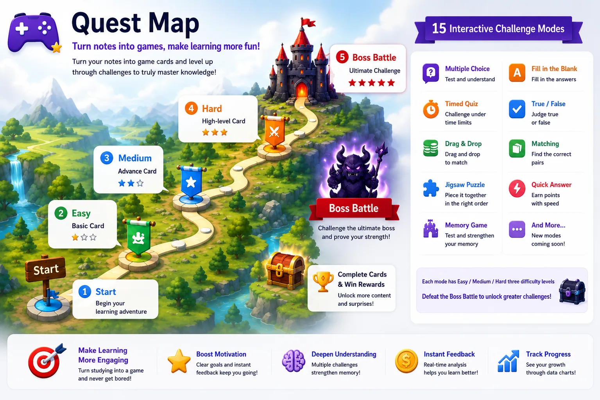
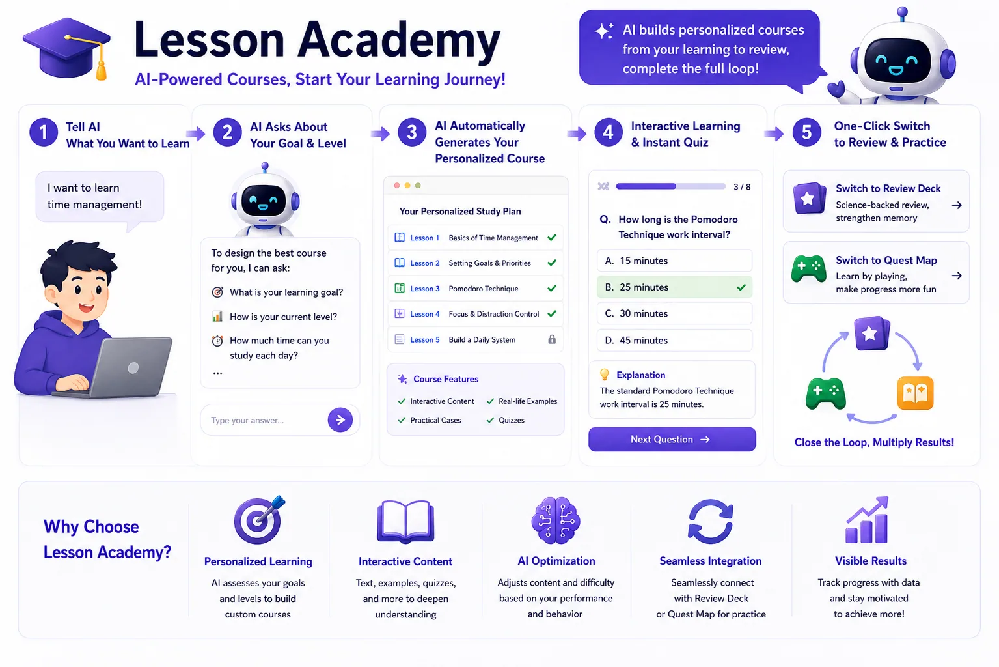
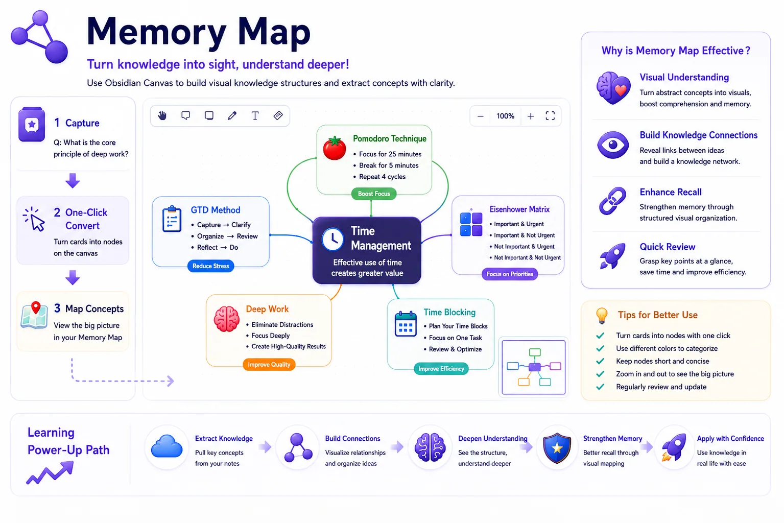
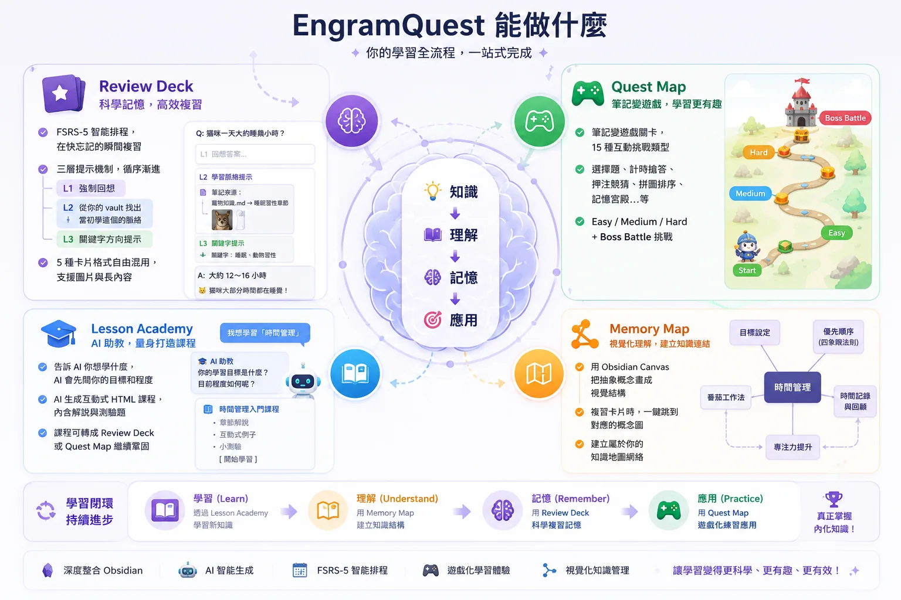
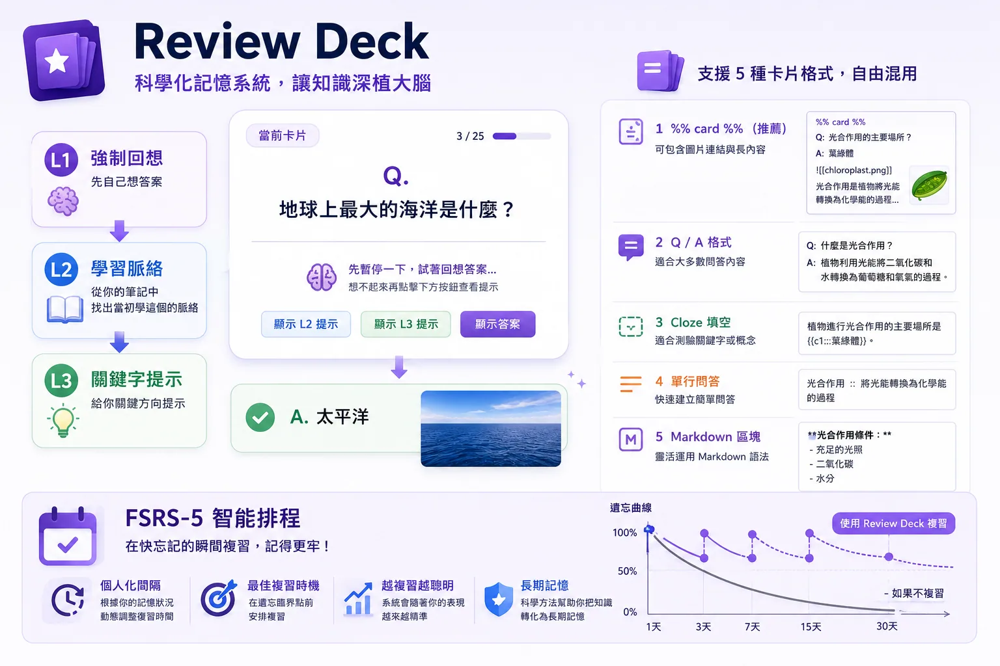
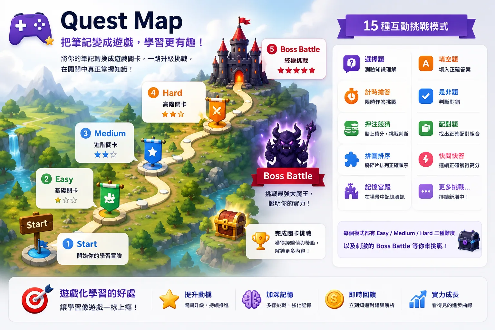
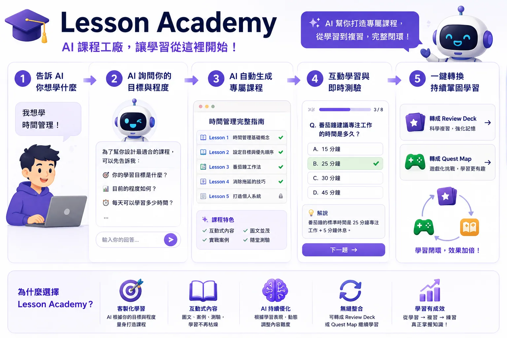
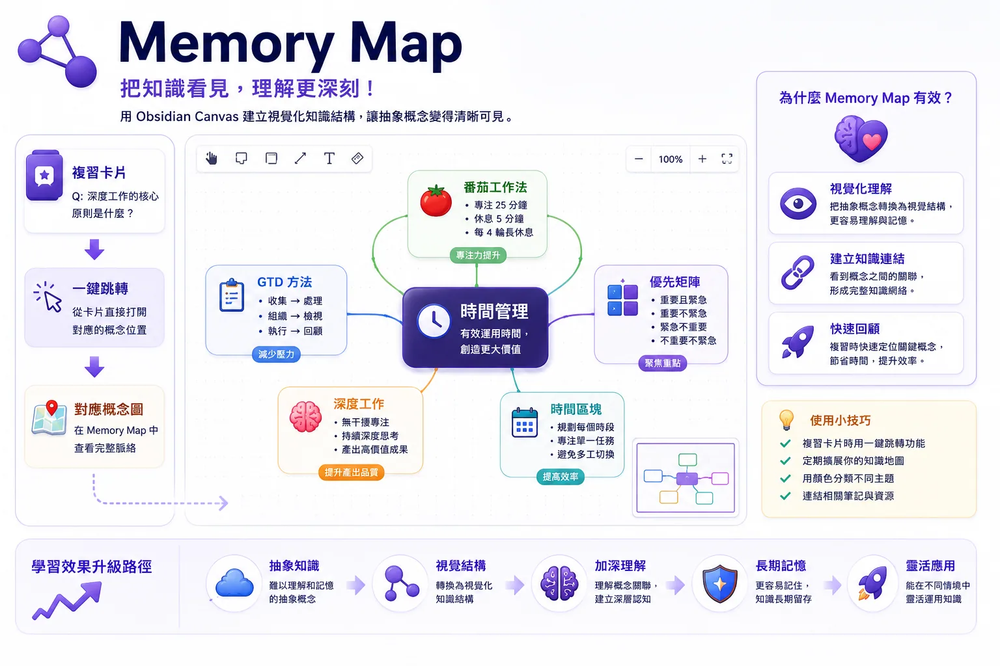

<div align="center">

**English** · [繁體中文](#-繁體中文)

# 🗺️ EngramQuest

**Carve your notes into memory — not just records, but traces in your mind.**

</div>

Your Obsidian vault is full of notes you wrote once and never looked at again. **EngramQuest turns those notes into a complete learning loop** — AI builds courses, game-like quests, and flashcards straight from what you already wrote, and FSRS spaced repetition makes the knowledge actually stick. One plugin takes you from **learning → practicing → remembering → connecting**.



> ### 🚀 Your first 60 seconds
> 1. **Install the plugin** — search **EngramQuest** in Community Plugins (or [open it in Obsidian](obsidian://show-plugin?id=engram-quest)).
> 2. **Open the Hub** — click the 🗺️ ribbon icon on the left.
> 3. **Pick a path:**
>    - **No AI?** Tag any note `#flashcards/topic`, write a `Q:/A:` card, and it appears in your Review Deck instantly. → [Write cards yourself](#-write-cards-yourself-no-ai-required)
>    - **Have an AI tool?** Install the Skills once (`Settings → EngramQuest → AI Skills`), then just say *"Build a review deck from my math notes."* → [The AI path](#-quick-start-ai-path)

---

## 💡 Why EngramQuest?

Anki solves *when* to review. EngramQuest solves *how* to actually remember — and what to do **before** the flashcard stage.

- **🎓 Learn it** — Lesson Academy: tell the AI a topic, it asks your goal and level, then builds an interactive HTML course you study inside Obsidian.
- **🗺️ Practice it** — Quest Map: dense notes become game-like island challenges with 15 interaction types, so you *engage* instead of re-reading.
- **🃏 Remember it** — Review Deck: a three-stage recall system (L1/L2/L3) on top of the FSRS-5 algorithm — newer and more accurate than Anki's SM-2.
- **🧠 Connect it** — Memory Map: AI lays abstract concepts onto an Obsidian Canvas so you see how everything links together.

Every module works on its own, or chains into the next. **AI is optional** — and it runs on the AI tools you already use (Claude Code, Codex, Antigravity, Gemini CLI, Cursor), not another subscription.

---

## ✨ Features

### 🃏 Review Deck — Remember More, Study Less



A three-stage recall system that builds real memory, not just familiarity:

| Stage | What it does | Anywhere else? |
|---|---|---|
| **L1 Active Recall** | Question only — forces your brain to search first, before any hint | ✅ most flashcards |
| **L2 Contextual Anchor** ⭐ | AI searches *your* vault and rebuilds the moment you first learned this topic | ❌ **only here** |
| **L3 Narrowing Hint** | A keyword direction as a last resort — never the full answer | rare |

- **FSRS-5 scheduling** — intervals adapt to your actual recall, not preset multipliers
- **AI cards stay separate** — generated cards live in `engram-review/`, AI never touches your source notes
- **5 mixable card formats** — paste long AI answers, multi-line Q&A, cloze, one-liners, all in one note
- **Edit writes back** — fix a card mid-review and the change saves to your source note
- **Auto-detection** — any note tagged `#flashcards/topic` is picked up automatically

### 🗺️ Quest Map — Turn Notes into Challenges



Transforms any note into a game-like island map, embedded in your vault as a `.md` file.

- **15 challenge types** — quiz, true/false, cloze, input, ordering, matching, countdown, snapshot, **auction (bet coins on your confidence)**, timeline, chain, **memory palace**, image quiz, image occlusion, and interactive iframe HTML simulations
- **Difficulty tiers** — Easy / Medium / Hard, ask your AI for the level you need
- **5 visual themes** — Sky Island, Sci-Fi, RPG, Ocean, Minimal
- **Boss Battle** — a chapter-mastery test at the end of each stage
- **Progress is safe** — scores and completion live apart from the quest YAML, so AI can update a quest without wiping your progress

### 🎓 Lesson Academy — AI-Built Courses



Tell the AI what you want to learn — it builds a course of interactive HTML lessons you study right inside Obsidian.

- **Goal-first** — the skill asks *why* you're learning and your current level, so a .NET dev learning React gets a different course than a designer would
- **Outline-first** — it shows the course plan for your approval before generating (changing the plan is cheap; regenerating lessons is not)
- **Vault-aware** — point it at your existing notes and the course connects to what you already know
- **Web-verified** — for fast-moving tech topics it checks the web and cites sources, instead of guessing
- **Each lesson ends with a quiz** for an immediate feedback loop — then convert the whole course into Review Deck cards or a Quest Map

### 🧠 Memory Map — See the Big Picture



Visualizes abstract concepts using Obsidian Canvas.

- AI generates a visual knowledge graph using memory science — novelty, association to your existing notes, chunking, and analogy
- Any file named `{note-name}-memory.canvas` is auto-detected in Hub → Memory Map
- During review, the Memory Map button finds and opens the matching canvas automatically

### 🏆 Achievements


Track your learning milestones with 3D-rendered icons and rarity tiers — from your first card to 2,000 reviews, 30-day streaks, and 50 mastered cards. Click any achievement for your activity calendar and progress data.

### 🎴 Quadrant Card — A4 Super-Memory (Pro)

Turns a single flashcard into an A4 four-quadrant "super memory" sheet (**Q1 question · Q2 answer · Q3 verbal metaphor · Q4 visual image**), each carrying its **own FSRS schedule** separate from your review decks. Upgrade existing cards in a batch, or create new ones directly — *"Make a quadrant card about the data flywheel."*

---

## ⚡ Quick Start (AI Path)

1. **Install the plugin** — [open in Obsidian](obsidian://show-plugin?id=engram-quest), search **EngramQuest** in Community Plugins, or grab it from [GitHub Releases](https://github.com/bahfahh/engram-quest/releases).
2. **Install the Skills** — go to `Settings → EngramQuest → AI Skills` and click **Install** for your tool (Claude Code, Codex / Antigravity, Gemini CLI, or Cursor).
   
3. **Ask your AI** — *"Turn `Note.md` into a quest-map medium"* or *"Build a review deck from notes tagged math."*
4. **Open the Hub** — click the 🗺️ ribbon icon, switch to the relevant tab, and start learning.

> **Not a SaaS.** Skills are the execution logic that run inside the AI tool you already have. No extra account, no subscription, and AI is fully optional.

---

## ✍️ Write Cards Yourself (No AI Required)

Add a `#flashcards/topic` tag and pick a format. All five are freely mixable in one note:

| Format | Best for | Syntax |
|---|---|---|
| 🟢 `Q:/A:` Q&A ⭐ | **Recommended daily format.** Multi-line answers, images, tables, code | `Q: question` → `A:` — two blank lines end the card |
| 🔵 `---` fenced Q&A | Existing notes where blank lines appear inside answers | Wrap `Q:/A:` with `---` lines |
| 🟡 `%%card%%` long answer | Pasted AI output that may contain its own `---` separators | Wrap one card between two `%%card%%` lines |
| 🧩 `{{c1::}}` Cloze | Fill-in-the-blank, Anki-compatible | `{{c1::answer}}` or `{{c1::answer::hint}}` |
| ⚪ `::` one-liner | Quick single-line Q&A only | `question :: answer` |

<details>
<summary>See card format examples</summary>

```
#flashcards/math

Q: What is a derivative?
A: The instantaneous rate of change of a function at a point.
   Formally: lim(h→0) [f(x+h) − f(x)] / h

---
Q: What is Stripe's core model?
A: Stripe is essentially a Saga system.
   It handles the payment_intent state machine, retry / failure handling,
   and fund consistency. You only receive the result.
---

%%card%%
Q: How should I explain agentic testing?
A:
Agentic testing checks whether an AI system can complete a task reliably.
---
This separator stays inside the answer.
%%card%%

{{c1::Calculus}} is built on limits, derivatives, and integrals.

Pythagorean theorem :: a² + b² = c²
```

> **Tip:** Press `Ctrl+/` (or `Cmd+/`) on an empty line — Obsidian inserts `%% %%` with the cursor inside. Type `card` and you get `%%card%%` instantly.

</details>

---

## 🔬 Why It Works

EngramQuest is built on four pillars of cognitive science:

| Principle | Feature |
|---|---|
| Spaced Repetition | FSRS schedules reviews at the moment of near-forgetting |
| Retrieval Practice | L1 forces active recall before any hint is shown |
| Contextual Anchoring | L2 anchors each card to knowledge already in your vault |
| Elaborative Encoding | Memory Map builds visual structure for abstract concepts |

---

## ❓ FAQ

**Q: Do I have to use AI?**
No — many users don't. Write cards with `Q:/A:`, `::`, or `{{c1::}}`, add a `#flashcards/topic` tag, and the plugin picks them up automatically.

**Q: Where is my progress stored?**
Scheduling data lives in `engram-review/sr/` inside your vault as JSON. AI-generated cards are in `engram-review/ai-cards/`. Neither touches your source notes.

**Q: Does EngramQuest support Anki?**
Partially. The `::` and `{{c1::}}` formats are Anki-compatible — pair them with the **Obsidian_to_Anki** community plugin. The `Q:/A:` format is EngramQuest-native (rich multi-line answers) and does not sync to Anki.

**Q: How do I make AI always follow a pattern when building decks?**
Mark key answers with `==highlight==` or `**bold**`, then add a rule to your AI config file (`CLAUDE.md`, `GEMINI.md`, or `AGENTS.md`):
> `IMPORTANT: When building a Review Deck, every highlighted ==text== must become a review card.`

---

## ☕ Support

If EngramQuest is useful to you, consider supporting its development:

[](https://ko-fi.com/wen_aidev)

---

<div align="center">

# 🇹🇼 繁體中文

[English ↑](#-engramquest)

**把筆記刻進記憶 — 不只是紀錄，而是腦中真實的痕跡。**

</div>

你的 Obsidian vault 塞滿了寫過一次、再也沒看的筆記。**EngramQuest 把這些筆記變成一個完整的學習閉環** — AI 直接從你寫過的內容生成課程、遊戲化關卡和閃卡，再用 FSRS 間隔複習讓知識真正留下來。一個插件帶你走完 **學 → 練 → 記 → 連**。



> ### 🚀 安裝後的第一分鐘
> 1. **安裝插件** — 在 Community Plugins 搜尋 **EngramQuest**（或[在 Obsidian 中開啟](obsidian://show-plugin?id=engram-quest)）。
> 2. **打開 Hub** — 點左側的 🗺️ ribbon 圖示。
> 3. **選一條路：**
>    - **不用 AI？** 任何筆記打上 `#flashcards/主題` tag，寫一張 `Q:/A:` 卡片，它就立刻出現在你的 Review Deck。→ [自己寫卡片](#-自己寫卡片不需要-ai)
>    - **有 AI 工具？** 安裝一次 Skills（`設定 → EngramQuest → AI Skills`），然後直接說：*「用我的數學筆記建一副 review deck。」* → [AI 路徑](#-快速開始ai-路徑)

---

## 💡 為什麼選 EngramQuest？

Anki 解決「何時複習」。EngramQuest 解決「如何真正記住」 — 以及閃卡階段**之前**該做什麼。

- **🎓 學會它** — Lesson Academy：告訴 AI 一個主題，它先問你的目標和程度，然後生成可在 Obsidian 內研讀的互動式 HTML 課程。
- **🗺️ 練習它** — Quest Map：密集的長筆記變成遊戲化島嶼關卡，15 種互動題型，讓你*動手投入*而不是重讀。
- **🃏 記住它** — Review Deck：建立在 FSRS-5 演算法上的三階回想系統（L1/L2/L3），比 Anki 的 SM-2 更新、更準。
- **🧠 連結它** — Memory Map：AI 把抽象概念鋪在 Obsidian Canvas 上，讓你看見一切如何串連。

每個模組都能單獨使用，也能串接到下一個。**AI 完全可選** — 而且它跑在你已經在用的 AI 工具上（Claude Code、Codex、Antigravity、Gemini CLI、Cursor），不是另一個訂閱服務。

---

## ✨ 功能特色

### 🃏 Review Deck — 記得更多，學得更少



一套建立真實記憶（而非單純「眼熟」）的三階回想系統：

| 階段 | 做什麼 | 其他工具有嗎 |
|---|---|---|
| **L1 主動回想** | 只給問題，強迫大腦在任何提示前先自行搜索 | ✅ 多數閃卡 |
| **L2 脈絡錨點** ⭐ | AI 搜尋*你的* vault，重建你第一次學這個概念的場景 | ❌ **只有這裡有** |
| **L3 收斂提示** | 最後手段，給關鍵字方向，不給答案本身 | 少數有 |

- **FSRS-5 排程** — 間隔依你的實際回想表現調整，不是固定倍數
- **AI 卡片獨立存放** — 生成的卡片放在 `engram-review/`，AI 永遠不動你的來源筆記
- **5 種可混用格式** — 貼整段 AI 回答、多行 Q&A、克漏字、單行卡，同一筆記自由混用
- **編輯寫回** — 複習中改卡片，修改直接存回來源筆記
- **自動偵測** — 任何打上 `#flashcards/主題` 的筆記都會自動收錄

### 🗺️ Quest Map — 把筆記變成關卡



把任何筆記變成遊戲化島嶼地圖，以 `.md` 檔嵌在你的 vault 裡。

- **15 種挑戰類型** — 選擇題、是非、克漏字、輸入、排序、配對、倒數計時、快照記憶、**競標（用籌碼押注你的信心）**、時間軸、序列接龍、**記憶宮殿**、圖片題、圖片遮罩，以及互動式 iframe HTML 模擬
- **難度分級** — Easy / Medium / Hard，跟 AI 要你需要的程度
- **5 種視覺主題** — 天空島、科幻、RPG、海洋、極簡
- **Boss Battle** — 每章結尾的綜合精熟測驗
- **進度安全** — 分數和完成度與 quest YAML 分開儲存，AI 更新關卡時不會洗掉你的進度

### 🎓 Lesson Academy — AI 打造的課程



告訴 AI 你想學什麼 — 它建立一整套可在 Obsidian 內研讀的互動式 HTML 課程。

- **目標導向** — skill 會先問你*為什麼*學、現在的程度，所以 .NET 工程師學 React 拿到的課，和設計師學 React 完全不同
- **課綱先行** — 生成前先給你課程大綱確認（改大綱很便宜，重生成課程很貴）
- **讀懂你的 vault** — 指向你既有的筆記，課程就和你已知的知識連在一起
- **網路查證** — 對快速更新的技術主題會查網路並附上來源，而不是瞎猜
- **每堂課以測驗結尾**，形成即時回饋迴圈 — 之後還能把整套課程轉成 Review Deck 卡片或 Quest Map

### 🧠 Memory Map — 看見全局



用 Obsidian Canvas 視覺化抽象概念。

- AI 用記憶科學生成視覺知識圖 — 反直覺（novelty）、連結你既有筆記（association）、分組（chunking）、類比（elaboration）
- 任何命名為 `{筆記名}-memory.canvas` 的檔案會在 Hub → Memory Map 自動偵測
- 複習途中，Memory Map 按鈕會自動找到並打開對應的 canvas

### 🏆 成就系統


用 3D 渲染圖示與稀有度分級追蹤你的學習里程碑 — 從第一張卡片到 2,000 次複習、30 天連續、50 張精熟卡。點任一成就查看你的活動日曆與進度數據。

### 🎴 四象限卡 — A4 超記憶（Pro）

把單張閃卡升級成一張 A4 四象限「超記憶」卡（**Q1 問題 · Q2 答案 · Q3 語言比喻 · Q4 視覺圖像**），每張卡有自己**獨立的 FSRS 排程**，與你的 review deck 分開。可批次升級既有卡片，也能直接建立新卡 — *「幫我做一張關於資料飛輪的四象限卡。」*

---

## ⚡ 快速開始（AI 路徑）

1. **安裝插件** — [在 Obsidian 中開啟](obsidian://show-plugin?id=engram-quest)、在 Community Plugins 搜尋 **EngramQuest**，或從 [GitHub Releases](https://github.com/bahfahh/engram-quest/releases) 下載。
2. **安裝 Skills** — 到 `設定 → EngramQuest → AI Skills`，為你的工具（Claude Code、Codex / Antigravity、Gemini CLI 或 Cursor）點 **安裝**。
   
3. **問你的 AI** — *「把 `Note.md` 變成 quest-map medium」* 或 *「用標 math 的筆記建一副 review deck。」*
4. **打開 Hub** — 點 🗺️ ribbon 圖示，切到對應分頁，開始學習。

> **不是 SaaS。** Skills 是在你已有的 AI 工具裡執行的邏輯，不需要額外帳號、不需要訂閱，而且 AI 完全可選。

---

## ✍️ 自己寫卡片（不需要 AI）

打上 `#flashcards/主題` tag，選一種格式。五種格式可在同一筆記自由混用：

| 格式 | 最適合 | 語法 |
|---|---|---|
| 🟢 `Q:/A:` 問答 ⭐ | **推薦的日常格式。** 多行答案、圖片、表格、程式碼 | `Q: 問題` → `A:` — 兩個空行結束卡片 |
| 🔵 `---` 圍欄問答 | 答案內含空行的既有筆記 | 用 `---` 行包住 `Q:/A:` |
| 🟡 `%%card%%` 長答案 | 貼可能含 `---` 分隔線的 AI 輸出 | 用兩行 `%%card%%` 包住一張卡 |
| 🧩 `{{c1::}}` 克漏字 | 填空，與 Anki 相容 | `{{c1::答案}}` 或 `{{c1::答案::提示}}` |
| ⚪ `::` 單行 | 快速單行問答 | `問題 :: 答案` |

<details>
<summary>看卡片格式範例</summary>

```
#flashcards/math

Q: 什麼是導數？
A: 函數在某點的瞬時變化率。
   形式上：lim(h→0) [f(x+h) − f(x)] / h

---
Q: Stripe 的核心模型是什麼？
A: Stripe 本質上是一個 Saga 系統。
   它處理 payment_intent 狀態機、重試/失敗處理、
   以及資金一致性。你只收到結果。
---

%%card%%
Q: 該怎麼解釋 agentic testing？
A:
Agentic testing 檢查一個 AI 系統能否可靠完成任務。
---
這個分隔線會留在答案裡面。
%%card%%

{{c1::微積分}} 建立在極限、導數、積分之上。

畢氏定理 :: a² + b² = c²
```

> **小技巧：** 在空行按 `Ctrl+/`（或 `Cmd+/`），Obsidian 會插入 `%% %%` 並把游標放中間。打 `card` 就立刻得到 `%%card%%`。

</details>

---

## 🔬 為什麼有效

EngramQuest 建立在認知科學的四根支柱上：

| 原理 | 對應功能 |
|---|---|
| 間隔複習 | FSRS 在快遺忘的瞬間安排複習 |
| 提取練習 | L1 在任何提示前強制主動回想 |
| 脈絡錨定 | L2 把每張卡錨定到 vault 既有的知識 |
| 精緻化編碼 | Memory Map 為抽象概念建立視覺結構 |

---

## ❓ 常見問題

**Q：一定要用 AI 嗎？**
不用 — 很多使用者都不用。用 `Q:/A:`、`::` 或 `{{c1::}}` 寫卡片，打上 `#flashcards/主題` tag，插件就會自動收錄。

**Q：我的進度存在哪？**
排程資料以 JSON 存在 vault 的 `engram-review/sr/`。AI 生成的卡片在 `engram-review/ai-cards/`。兩者都不碰你的來源筆記。

**Q：EngramQuest 支援 Anki 嗎？**
部分支援。`::` 和 `{{c1::}}` 格式與 Anki 相容 — 搭配 **Obsidian_to_Anki** 社群插件使用。`Q:/A:` 是 EngramQuest 原生格式（豐富的多行答案），不同步到 Anki。

**Q：怎麼讓 AI 建卡時永遠遵守某個模式？**
在筆記用 `==highlight==` 或 `**bold**` 標記關鍵答案，然後在 AI 設定檔（`CLAUDE.md`、`GEMINI.md` 或 `AGENTS.md`）加一條規則：
> `IMPORTANT: When building a Review Deck, every highlighted ==text== must become a review card.`

---

## ☕ 支持

如果 EngramQuest 對你有幫助，歡迎支持它的開發：

[](https://ko-fi.com/wen_aidev)

---

<div align="center">

*Built for lifelong learners. Made with ❤️*

</div>
