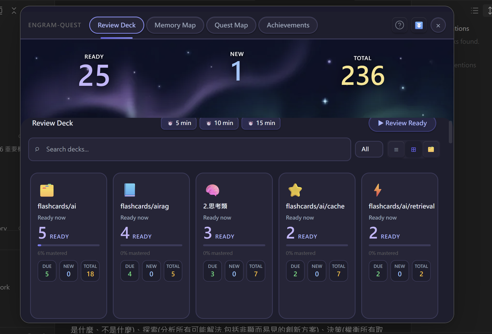
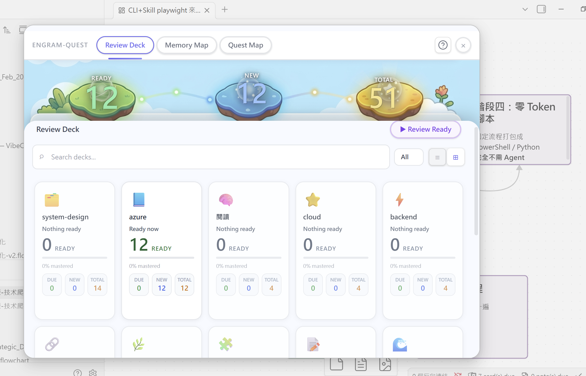
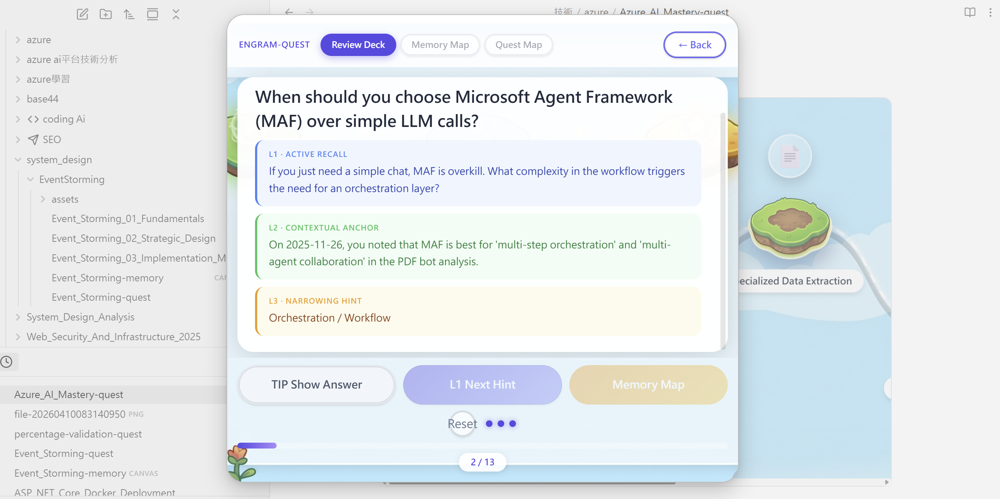
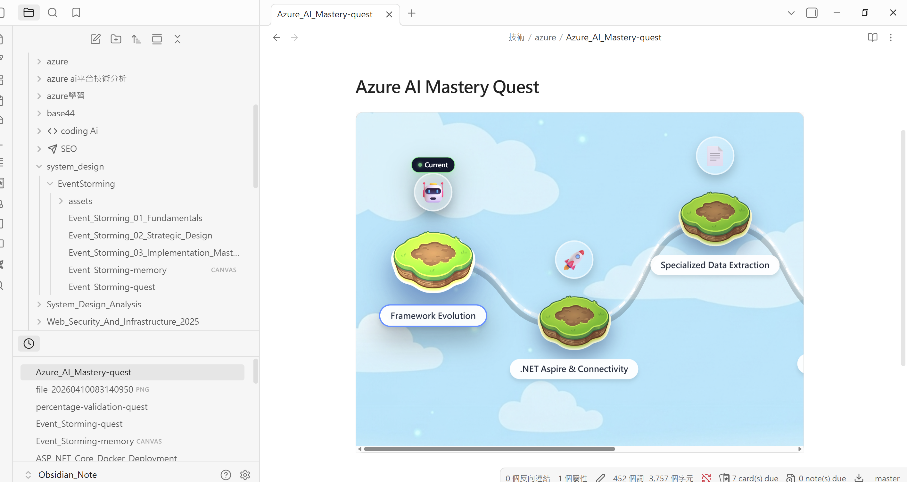
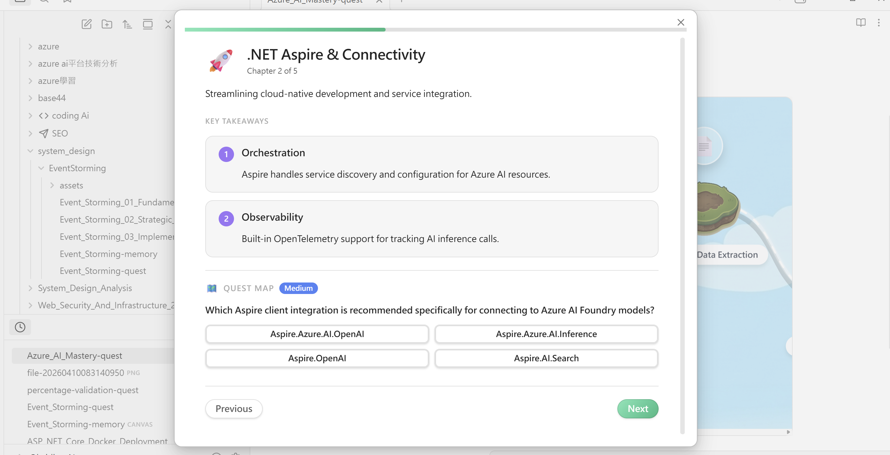
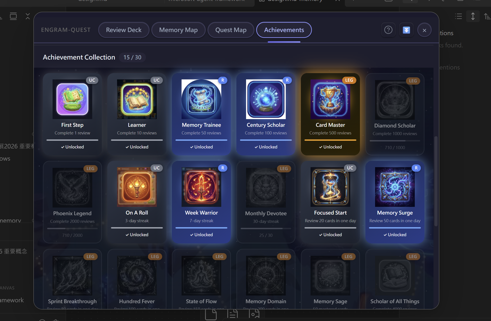
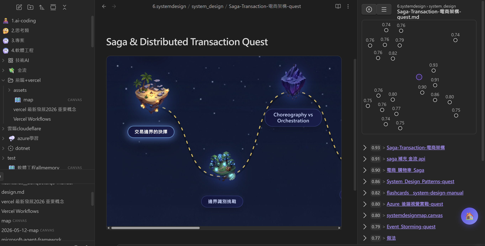
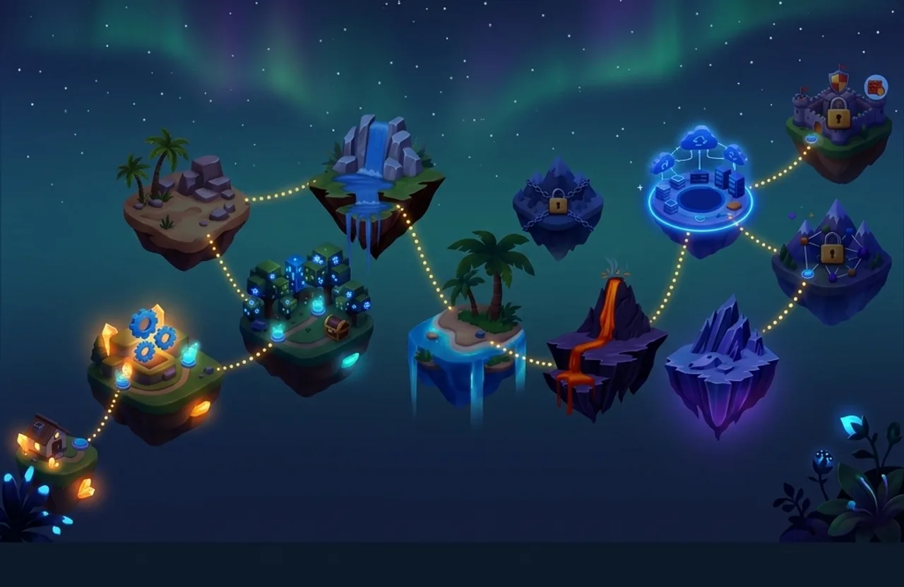
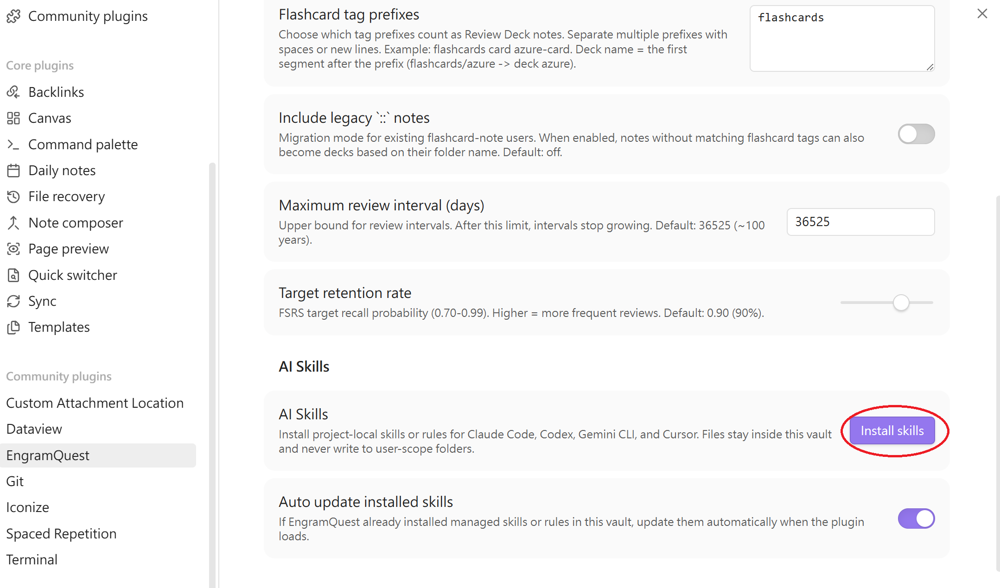

<div align="center">

[](README.zh.md)

# 🗺️ EngramQuest

**Carve your notes into memory.**  
*Not just records — traces in your mind.*

Generate flashcard decks and quest maps from your Obsidian notes — AI deepens memory connections, FSRS spaced repetition makes the knowledge truly last.



[](https://github.com/bahfahh/engram-quest/releases)

</div>

---

## 💡 Why EngramQuest?

Anki solves *when* to review. EngramQuest solves *how* to actually remember.

- **L2 Contextual Anchor** — AI searches your vault, finds what you already knew when you first learned this topic, and rebuilds that moment of understanding. No other flashcard tool does this.
- **FSRS algorithm** — newer and more accurate than Anki's SM-2. Intervals adapt to your actual recall performance, not fixed multipliers.
- **Quest Maps** — turn dense long notes into game-like island challenges. You engage with the material instead of re-reading it.

---

## ✨ Features

### 🃏 Review Deck — Remember More, Study Less



A three-stage recall system that builds real memory — not just familiarity:



| Stage | What it does |
|---|---|
| **L1 Active Recall** | Question only — forces your brain to search first, before any hint |
| **L2 Contextual Anchor** ⭐ | AI finds related notes in *your* vault and rebuilds the moment you first learned this. Anki can't do this. |
| **L3 Narrowing Hint** | A keyword direction as last resort — never gives the full answer |

- **FSRS scheduling** — intervals adapt to your actual recall, not preset multipliers
- **AI cards stay separate** — generated cards live in `engram-review/`, AI never touches your source notes
- **Edit writes back** — Highlight and Edit tools write changes directly to your source note, keeping it the single source of truth
- **Auto-detection** — any note tagged `#flashcards/topic` is picked up automatically
- **Source note link** — jump from any card to its origin note mid-session, then return right where you left off

### 🗺️ Quest Map — Turn Notes into Challenges





Transforms any note into a game-like island map, embedded directly in your vault as a `.md` file.

- **15 challenge types:** quiz, true/false, cloze, input, ordering, matching, countdown, snapshot, auction, timeline, chain, memory palace, image quiz, image occlusion, and iframe HTML simulations.
- **Persistent progress:** completed nodes, progress, and best scores are stored separately from quest YAML, so AI can update a quest without wiping your progress.
- **Difficulty tiers:** Easy / Medium / Hard — ask your AI for the level you need
- **5 visual themes:** Sky Island, Sci-Fi, RPG, Ocean, Minimal
- **Boss Battle** — a chapter mastery test at the end of each stage

### 🏆 Achievements



Track your learning milestones with 3D-rendered icons and rarity tiers.

- **10 milestones:** from your first card to 2,000 total reviews, 30-day streaks, 50 mastered cards, and more
- **Rarity tiers:** Uncommon (UC) → Rare (R) → Legendary (LEG) — rarer achievements glow with special borders
- Click any achievement card for your progress data, activity calendar, and daily review records

### 🧠 Memory Map — See the Big Picture



Visualizes abstract concepts using Obsidian Canvas.

- AI generates a visual knowledge graph — analogies, contrasts, and contextual anchoring make abstract topics stick
- Any file named `{note-name}-memory.canvas` is auto-detected in Hub → Memory Map
- During review, the Memory Map button finds and opens the matching canvas automatically

### 🎓 Lesson Academy — AI-Built Courses

Tell the AI what you want to learn — it builds a course of interactive HTML lessons you study right inside Obsidian.

- Ask the **Lesson Academy skill**: *"Teach me SEO"* or *"I want to learn .NET — build me a course"*. It asks about your goal and level, designs an outline, then generates self-contained HTML lessons with built-in quizzes
- Open Hub → **Learn → Lessons**: courses appear as color-themed cards with progress bars; click a lesson to read it, mark it done, star the important ones
- With many courses, filter and sort the cards by **tag / progress / newest** using the dropdowns above the card strip — your picks are remembered across sessions
- **Plan first, generate later**: create a course and outline directly in the plugin (or let the AI draft one) — planned lessons show as "pending" until you ask the skill to generate their content
- **Import HTML** lessons made anywhere else (e.g. by Gemini) straight into a course
- Works for any topic — programming, marketing, medicine, yoga. Finished a course? Ask the AI to turn it into Review Deck cards or a Quest Map

### 🎴 Quadrant Card — A4 Super-Memory (Pro)

Turns a single flashcard into an A4 four-quadrant "super memory" sheet: **Q1 question, Q2 answer, Q3 verbal metaphor, Q4 visual image**. Each card renders as an interactive sheet and carries its **own FSRS schedule** — separate from your review decks.

- **Upgrade** existing flashcards: mark cards from the review session, then tell the Quadrant Card skill *"upgrade"* — it converts everything you queued in one pass
- **Create** new cards directly: *"Make a quadrant card about the data flywheel"*
- Review them in Hub → Quadrant Cards, with due/new counts and self-assessment driving the schedule
- On a review card: 📄 opens the **source note** it was upgraded from, 📋 **copies** the question & answer, and ✏️ **edits** it — the title applies instantly, while Q1–Q4 content edits are rebuilt into the card's visuals the next time you run the Quadrant Card skill and say *"upgrade"*
- **Delete** cards you no longer need: a 🗑️ button on each deck row (removes the whole group) or inside the review card (removes one) moves them to trash

### 🌙 Dark Mode



Seamless automatic theme detection — no manual toggle. Hub, review session, and achievements all switch between light and dark assets automatically.

---

## ⚡ Quick Start (AI Path)

1. **Install Plugin** — [Open directly in Obsidian](obsidian://show-plugin?id=engram-quest), search **EngramQuest** in Community Plugins, or download from [GitHub Releases](https://github.com/bahfahh/engram-quest/releases).
2. **Install Skills** — go to `Settings → EngramQuest → AI Skills` and click **Install** for your tool (Claude Code, Gemini CLI, Cursor, or Codex).
   
3. **Ask AI** — *"Turn `Note.md` into a quest-map medium"* or *"Build a review deck from notes tagged with math."*
4. **Open Hub** — click the EngramQuest ribbon icon, switch to the relevant tab, and start learning.

---

## ✍️ Write Cards Yourself (No AI Required)

Add a `#flashcards/topic` tag and pick a format. Three formats are freely mixable in one note:

| Format | Best for | Syntax |
|---|---|---|
| 🟢 `Q:/A:` Q&A ⭐ | **Recommended daily format.** Multi-line answers, images, tables, code blocks | `Q: question` → `A:` — two blank lines end the card |
| 🔵 `---` fenced Q&A | Existing notes where blank lines appear inside answers | Wrap `Q:/A:` with `---` lines |
| 🟡 `%%card%%` long answer | Pasted AI output that may contain its own `---` separators | Wrap one card between two `%%card%%` lines |
| 🧩 `{{c1::}}` Cloze | Fill-in-the-blank, Anki-compatible | `{{c1::answer}}` or `{{c1::answer::hint}}` |
| ⚪ `::` one-liner | Quick single-line Q&A only | `question :: answer` |

<details>
<summary>See card format examples</summary>

```
#flashcards/math

Q: What is a derivative?
A: The instantaneous rate of change of a function at a point.
   Formally: lim(h→0) [f(x+h) − f(x)] / h

Q: What does this diagram show?
![[architecture.png]]
A: The architecture of a microservice system.

---
Q: What is Stripe's core model?
A: Stripe is essentially a Saga system.
   It handles payment_intent state machine, retry / failure handling,
   and fund consistency. You only receive the result.
---

%%card%%
Q: How should I explain agentic testing?
A:
Agentic testing checks whether an AI system can complete a task reliably.
---
This separator stays inside the answer.
%%card%%

{{c1::Calculus}} is built on limits, derivatives, and integrals.

Pythagorean theorem :: a² + b² = c²
```

> **Tip:** Press `Ctrl+/` (or `Cmd+/`) on an empty line — Obsidian inserts `%% %%` and places the cursor inside. Type `card` and you get `%%card%%` instantly.

</details>

---

## 🔬 Why It Works

EngramQuest is built on four pillars of cognitive science:

| Principle | Feature |
|---|---|
| Spaced Repetition | FSRS schedules reviews at the moment of near-forgetting |
| Retrieval Practice | L1 forces active recall before any hint is shown |
| Contextual Anchoring | L2 anchors each card to knowledge already in your vault |
| Elaborative Encoding | Memory Map builds visual structure for abstract concepts |

---

## ❓ FAQ

**Q: Do I have to use AI?**  
No — many users don't. Write cards with `::`, `Q:/A:`, or `{{c1::}}`, add a `#flashcards/topic` tag, and the plugin picks them up automatically.

**Q: Where is my progress stored?**  
Scheduling data lives in `engram-review/sr/` inside your vault as JSON files. AI-generated cards are in `engram-review/ai-cards/`. Neither touches your source notes.

**Q: Does EngramQuest support Anki?**  
Partially. The `::` and `{{c1::}}` formats are Anki-compatible — pair them with the **Obsidian_to_Anki** community plugin. The `Q:/A:` format is EngramQuest-native (rich multi-line answers) and does not sync to Anki.

**Q: How do I make AI always follow a specific pattern when building decks?**  
Mark key answers in your notes using `==highlight==` or `**bold**`, then add a rule to your AI config file (`CLAUDE.md`, `GEMINI.md`, or `AGENTS.md`):
> `IMPORTANT: When building a Review Deck, every highlighted ==text== must be turned into a review card.`

---

## ☕ Support

If EngramQuest is useful to you, consider supporting its development:

[](https://ko-fi.com/wen_aidev)

---

*Built for lifelong learners. Made with ❤️*
